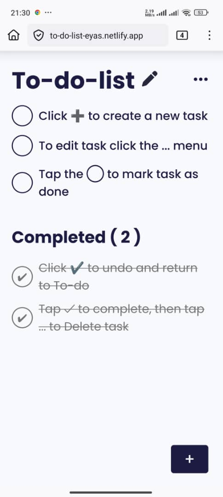

# ✅ To-Do List



[🔗 Live demo](https://to-do-list-eyas.netlify.app/) · 

## Overview

A simple and responsive **To-Do List Web App** built with **HTML**, **CSS**, and **Vanilla JavaScript**.  
This project demonstrates **CRUD operations (Create, Read, Update, Delete)** on tasks, **DOM manipulation**, and **local storage usage**.  
**Responsive design:** optimized for mobile, tablet, and desktop.

---

## Features

* ➕ Add new tasks easily  
* ✅ Mark tasks as completed  
* ❌ Delete tasks  
* ✏️ Edit/update tasks  
* 💾 Local storage support (keeps tasks even after page refresh)  
* 📱 Responsive layout for all screen sizes  
* Clean and minimal UI design  

---

## Project Structure

```bash
to-do-list/
├─ index.html
├─ css/
│  └─ style.css
├─ js/
│  └─ script.js
├─ assets/
│  └─ screenshot.jpg
└─ README.md
